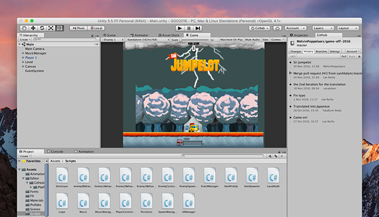
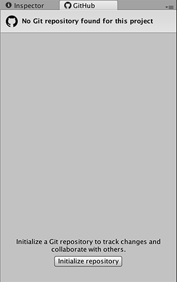
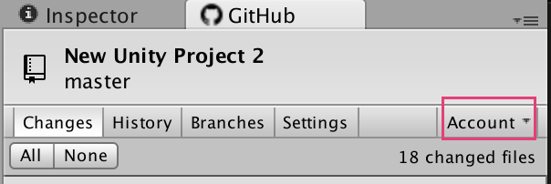
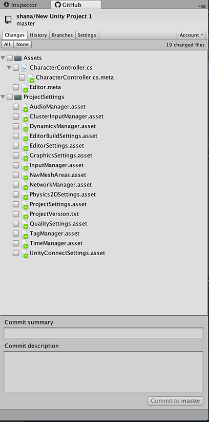
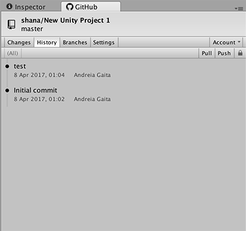
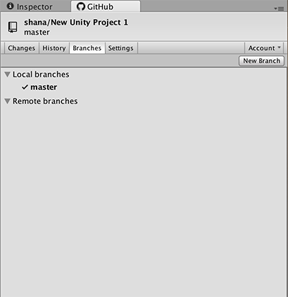
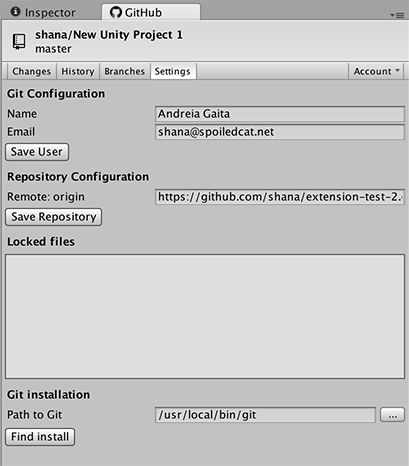

# GitHub for Unity

Welcome to the GitHub for Unity preview!  

The GitHub for Unity plugin brings Git and GitHub into Unity, integrating source control into your work with friendly and accessible tools and workflows.

This software is currently on [Early Access](https://developer.github.com/early-access/) and is alpha-quality. Please check the release notes for bugs and known issues, and make sure you have backups of your work. Use with care.

For any questions or bug reports, you can [open an issue](https://github.com/github-beta/unity-preview/issues/new) in our issue tracker, or send email to [unity@github.com](mailto:unity@github.com).

[](img/screenshot.png)


## Installing

To install the extension, [download the package](https://github.com/github-beta/unity-preview/releases/tag/v0.8-alpha) from [the releases page](https://github.com/github/UnityInternal/releases) and double click on it.

## Opening the GitHub window

You can access the GitHub window by going to Windows -> GitHub. The window opens by default next to the Inspector window.

### Initialize Repository

[](img/initialize-repository.png)

If the current Unity project is not in a git repository, the GitHub for Unity extension will offer to initialize the repository for you. This will:

- Initialize a git repository at the Unity project root via `git init`
- Initialize git-lfs via `git lfs install`
- Set up a `.gitignore` file at the Unity project root.
- Set up a `.gitattributes` file at the Unity project root with a large list of known binary filetypes (images, audio, etc) that should be tracked by LFS
- Configure the project to serialize meta files as text
- Create an initial commit with the `.gitignore` and `.gitattributes` file.

### Authentication

To set up credentials in git so you can push and pull, you can sign in to GitHub by going to `Window` -> `GitHub` -> `Account` -> `Sign in`. You only have to sign in successfully once, your credentials will remain on the system for all git operations in Unity and outside of it. If you've already signed in once but the Account dropdown still says `Sign in`, ignore it, it's a bug.

[](img/signin.png)

### Publish a new repository

1. Go to [github.com](https://github.com) and create a new empty repository - do not add a license, readme or other files during the creation process
2. Copy the **https** url shown in the creation page
3. In Unity, go to `Windows` -> `GitHub` -> `Settings` and paste the url into the `Remote` textbox.
3. Click `Save repository`.
4. Go to the `History` tab and click `Push`

### Commiting your work - Changes tab

You can see which files have been changed and commit them through the Changes tab. `.meta` files will show up in relation to their files on the tree, so you can select a file for comitting and automatically have their `.meta` 

[](img/changes.png)

### Pushing/pulling your work - History tab

The history tab includes a `Push` button to push your work to the server. Make sure you have a remote url configured in the `Settings` tab so that you can push and pull your work.

To receive updates from the server by clicking on the `Pull` button. You cannot pull if you have local changes, so commit your changes before pulling.

[](img/history.png)

### Branches tab

[](img/branches.png)

### Settings tab

You can configure your user data in the Settings tab, along with the path to the git installation.

Locked files will appear in a list in the Settings tab. You can see who has locked a file and release file locks after you've pushed your work.

[](img/settings.png)

## Windows

The GitHub for Unity extension ships with a bundle of git and git-lfs, to ensure that you have the correct version. These will be installed into `%LOCALAPPDATA%\GitHubUnityDebug` when the extension runs for the first time.

You can open a command line with the same git and git-lfs version that the extension uses by going to the GitHub -> Command line menu.

Make sure a git user and email address are set in the `%HOME%\.gitconfig` file before you initialize a repository for the first time. You can set these values by opening your `%HOME%\.gitconfig`  file and adding the following section, if it doesn't exist yet:

```
[user]
	name = Your Name
	email = Your Email
```

### Log files

The extension log file can be found at `%LOCALAPPDATA%\GitHubUnityDebug\github-unity.log`

## macOS

The current release has limited macOS support. macOS users will need to install the latest [git](https://git-scm.com/downloads) and [git-lfs](https://git-lfs.github.com/) manually, and make sure these are on the path. You can configure the git location in the Settings tab on the GitHub window.

Make sure a git user and email address are set in the `~/.gitconfig` file before you initialize a repository for the first time. You can set these values by opening your `~/.gitconfig` file and adding the following section, if it doesn't exist yet:

```
[user]
	name = Your Name
	email = Your Email
```

### Log files

The extension log file can be found at `~/.local/share/GitHubUnityDebug/github-unity.log`. This is a temporary location and will be changed in the future.